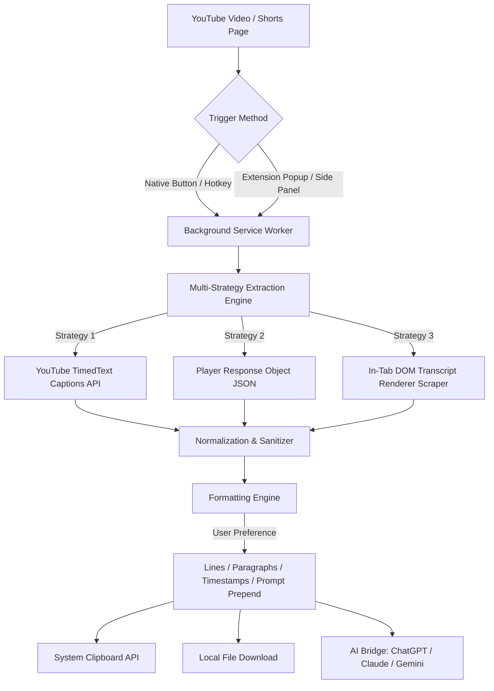

# 🎬 YouTube Transcript Copier

<p align="center">
  
</p>

<p align="center">
  <strong>Fast, intelligent, and versatile YouTube transcript extraction with Side Panel persistence, batch processing, and 1-click AI workflow.</strong>
</p>

<p align="center">
  
  
  
  
  
  <a href="https://chromewebstore.google.com/detail/youtube-transcript-copier/khbenieolkkkjjokcfklaokfpdblkgbn"></a>
</p>

---

## 🌟 Overview

**YouTube Transcript Copier** is a privacy-first browser extension engineered to extract, format, and export YouTube video transcripts in milliseconds. Built with a resilient multi-strategy extraction engine, it bypasses DOM volatility and provides seamless integration with modern AI tools like ChatGPT, Claude, and Gemini.

Whether you're a researcher analyzing lectures, a student taking notes, a content creator repurposing video scripts, or an engineer querying code walkthroughs, YouTube Transcript Copier delivers clean, timestamped transcriptions directly to your clipboard or favorite AI tool in one click.

---

## 🔥 Key Features

### ⚡ 1-Click Instant Extraction & Native Player Button
- **Native Action Bar Integration**: Injects a clean, native-styled "Transcript" button directly into YouTube's player action bar and Shorts reels.
- **Auto-Copy on Video Load**: Optionally copies the transcript automatically as soon as a video opens.
- **Global Keyboard Shortcut**: Trigger instant extraction anywhere on YouTube using `Ctrl + Shift + Y` (Windows/Linux) or `Cmd + Shift + Y` (macOS).

### 📑 Persistent Side Panel Drawer (Chrome 114+)
- **Side-by-Side Reading**: Keep transcripts visible in Chrome's native right-hand side panel while browsing or watching videos full-screen.
- **Live Search & Filter**: Real-time text search with highlight matching across thousands of transcript lines.
- **Click-to-Seek Navigation**: Click any timestamp in the preview to immediately seek the video player to that exact moment.

### 🚀 Batch Mode: Multi-Video & Playlist Extraction
- **Playlist Scanning**: Automatically detects playlist queues, channel uploads, and recommended videos on the page.
- **Select & Extract**: Bulk extract dozens of video transcripts with a single click.
- **Lifecycle Controls**: Real-time progress bar, individual success/failure badges, and **Pause / Resume / Stop** controls.
- **AI Token Safety Guard**: Built-in character and token counter alerts you before sending overly large transcripts to LLMs.
- **Bulk Zip Download**: Export all extracted transcripts simultaneously in a neatly organized ZIP archive.

### 🤖 1-Click Free AI Web Bridge (with Auto-Paste)
- **Direct Bridge**: Export transcripts directly into **ChatGPT**, **Claude**, or **Gemini** with automated tab launching.
- **Automated Text Insertion**: Injects your selected prompt and transcript directly into the chat prompt box—no manual pasting required.
- **Custom Prompt Manager**: Choose from built-in prompt presets (*Summarize 5 Bullets*, *Key Takeaways*, *Chapter Outline*, *TL;DR*) or save and manage your own custom reusable prompts.

### 📁 Multi-Format Exporter
Export transcripts into standard production formats:
- **SRT (`.srt`)**: SubRip subtitle format for video editors (Premiere, Final Cut, DaVinci Resolve).
- **VTT (`.vtt`)**: WebVTT subtitles for HTML5 video and web players.
- **Markdown (`.md`)**: Formatted notes for Obsidian, Notion, Logseq, and GitHub.
- **JSON (`.json`)**: Structured timestamp and text arrays for developers and data analysis.
- **CSV (`.csv`)**: Spreadsheet-ready columns (`Timestamp, Time (Seconds), Text`) for Excel and Google Sheets.
- **Plain Text (`.txt`)**: Clean continuous paragraph or line-by-line format.

### 🌍 Multilingual & Native RTL Support
Fully localized UI with instant language switching across **7 languages**:
- 🇺🇸 English (`en`)
- 🇪🇸 Spanish / Español (`es`)
- 🇧🇷 Portuguese / Português (`pt`)
- 🇹🇷 Turkish / Türkçe (`tr`)
- 🇫🇷 French / Français (`fr`)
- 🇩🇪 German / Deutsch (`de`)
- 🇸🇦 Arabic / العربية (`ar`) with full **Right-to-Left (RTL)** layout support.

### 🔒 100% Privacy-First Architecture
- **Zero Remote Servers**: All extraction, formatting, and storage occurs entirely within your browser client.
- **No Analytics / Telemetry**: Zero user tracking, zero ads, and zero third-party telemetry scripts.
- **No API Keys Required**: Does not require any external paid API keys or subscriptions.

---

## 🛠️ Architecture & Extraction Pipeline



---

## 🚀 Installation

### Option 1: Chrome Web Store (Recommended)
Install directly from the official [Chrome Web Store](https://chromewebstore.google.com/detail/youtube-transcript-copier/khbenieolkkkjjokcfklaokfpdblkgbn).

### Option 2: Manual Installation (Developer Mode)
1. Clone this repository or download the source code:
   ```bash
   git clone https://github.com/madireis/youtube-transcript-copier.git
   ```
2. Open Chrome and navigate to `chrome://extensions/`.
3. Enable **Developer mode** in the top-right corner.
4. Click **Load unpacked** and select the extension directory.
5. Pin the extension to your toolbar and open any YouTube video!

---

## ⌨️ Keyboard Shortcuts

| Shortcut | Action | Scope |
| :--- | :--- | :--- |
| `Ctrl + Shift + Y` (Win/Linux) | Copy formatted transcript to clipboard | Active YouTube tab |
| `Cmd + Shift + Y` (macOS) | Copy formatted transcript to clipboard | Active YouTube tab |

*Note: You can customize keyboard shortcuts at any time by navigating to `chrome://extensions/shortcuts` in your browser.*

---

## 📂 Project Structure

```text
├── icons/                      # Extension icons & AI vector brand SVGs
├── background.js               # Manifest V3 background service worker & batch runner
├── content.js                  # In-tab DOM extraction & transcript reader
├── youtube_button.js           # Native 1-click action bar & shorts button injector
├── batch_content.js            # Playlist and video scanner for batch mode
├── batch_overlay.js            # In-page batch extraction progress overlay
├── storage_vault.js            # Offline workspace & saved transcripts vault
├── ai_workspace_engine.js      # Multi-prompt AI workspace formatting engine
├── ai_autopaste.js             # Autonomous text inserter for AI web chats
├── popup.html                  # Extension popup & Chrome Side Panel markup
├── popup.css                   # Responsive styles, dark mode & RTL support
├── popup.js                    # UI logic, i18n localization engine & state management
├── manifest.json               # Manifest V3 configuration
├── PRIVACY_POLICY.md           # Official privacy policy
└── README.md                   # Project documentation
```

---

## 🧪 Testing & Verification

The repository includes automated UI validation and offline test runners:

```bash
# Run automated tests
npm test
```

---

## 📄 License

This project is licensed under the [MIT License](LICENSE).

---

<p align="center">
  Crafted with care by <a href="https://github.com/madireis">@madireis</a>. If you find this extension helpful, please consider leaving a ⭐️ on GitHub and a review on the <a href="https://chromewebstore.google.com/detail/youtube-transcript-copier/khbenieolkkkjjokcfklaokfpdblkgbn/reviews">Chrome Web Store</a>!
</p>
