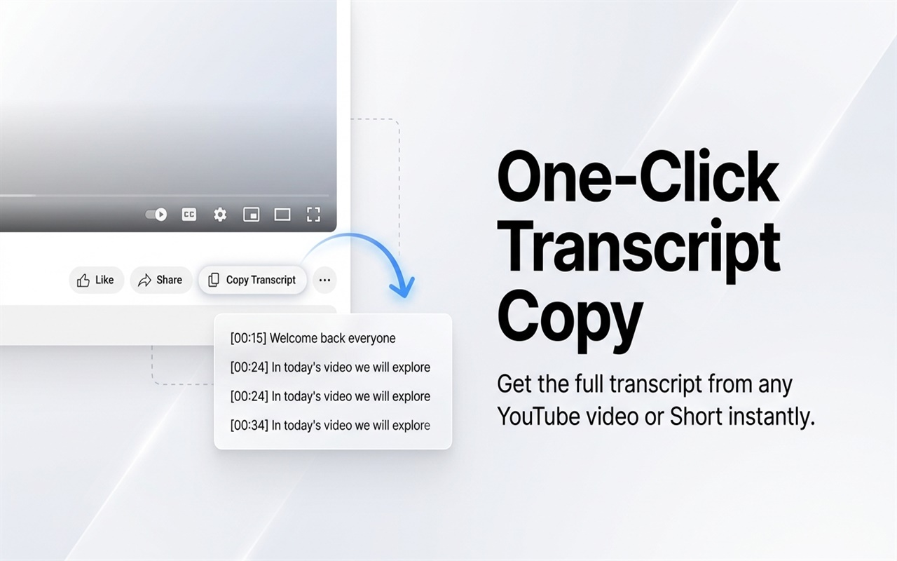
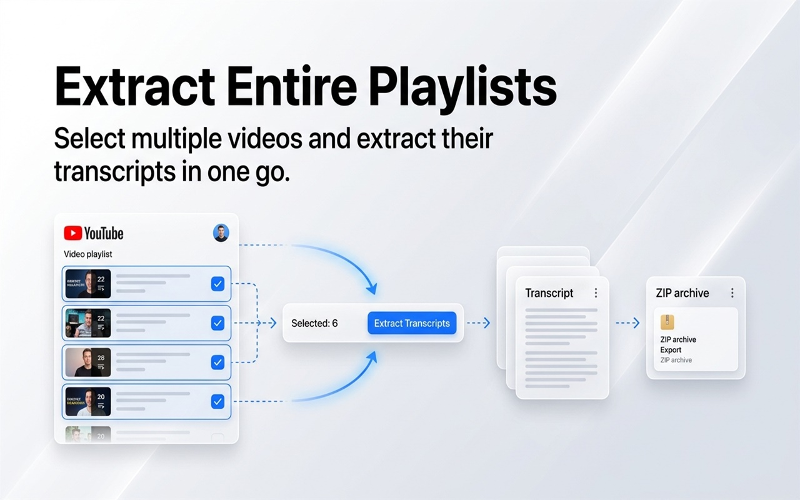
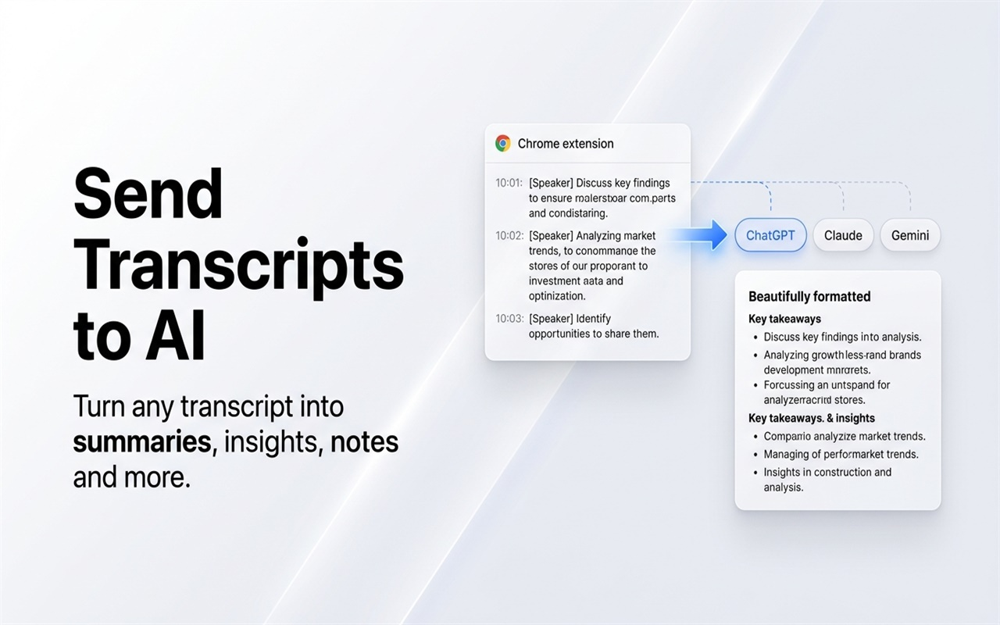
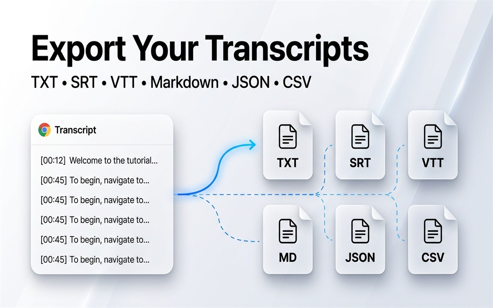
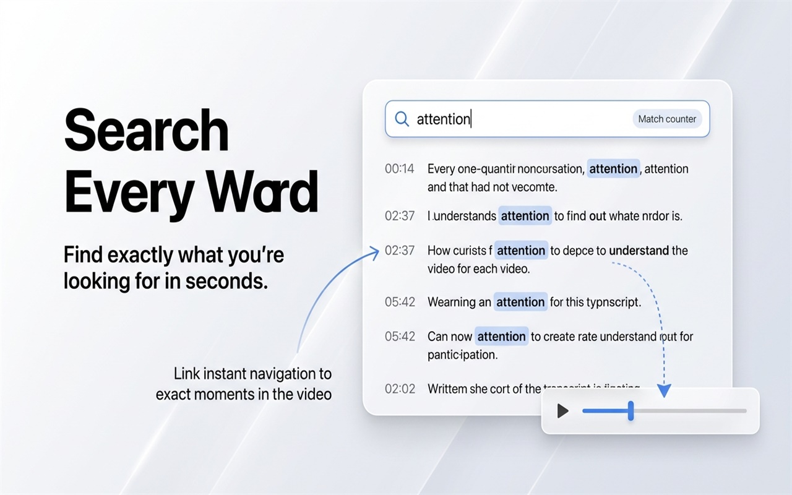
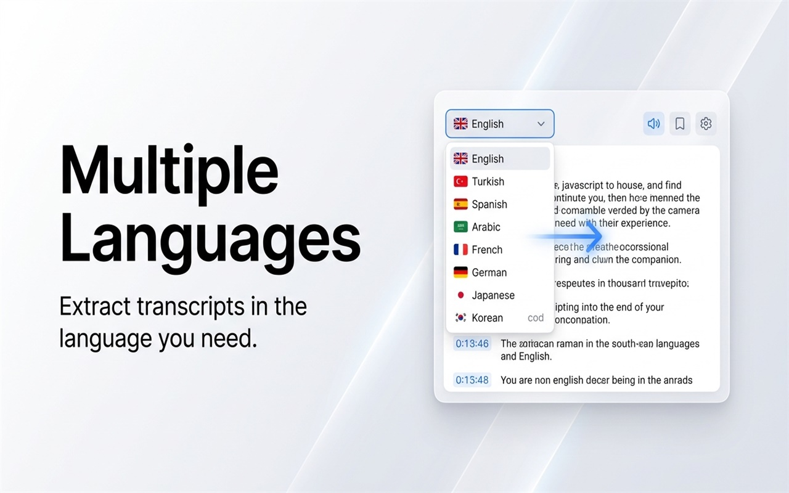
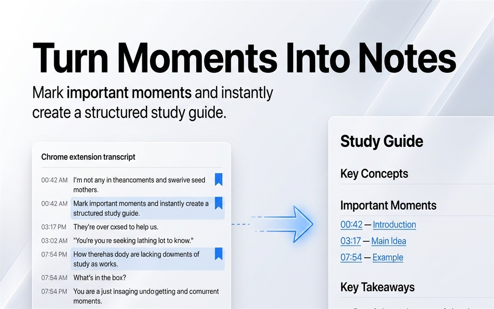

# 🎬 YouTube Transcript Copier

<p align="center">
  
</p>

<p align="center">
  <strong>Fast, intelligent, and versatile YouTube transcript extraction with Side Panel persistence, batch processing, and 1-click AI workflow.</strong>
</p>

<p align="center">
  <a href="https://chromewebstore.google.com/detail/youtube-transcript-copier/khbenieolkkkjjokcfklaokfpdblkgbn"></a>
  
  
  
</p>

<p align="center">
  
</p>

---

## 🌟 Overview

**YouTube Transcript Copier** is a privacy-first browser extension engineered to extract, format, and export YouTube transcripts in milliseconds. Built with a resilient multi-strategy extraction engine, it bypasses DOM volatility and provides seamless integration with modern AI tools like ChatGPT, Claude, and Gemini.

Whether you are a student, researcher, developer, or creator, YouTube Transcript Copier saves hours of manual copying and formatting.

---

## ✨ Features

### 1. ⚡ 1-Click Native Player Button & Auto-Copy
- **Native Player Integration**: Adds an unobtrusive "Copy Transcript" button right next to YouTube's Like/Share buttons and inside YouTube Shorts reels.
- **Auto-Copy on Video Load**: Toggle auto-copy in settings to automatically grab transcripts the instant any video opens.
- **Global Shortcut**: Press `Ctrl + Shift + Y` (Windows/Linux) or `Cmd + Shift + Y` (macOS) to copy without touching your mouse.

---

### 2. 🚀 Batch Multi-Video & Playlist Extraction
<p align="center">
  
</p>

- **Automated Scanner**: Detects playlists, recommended queues, and channel uploads directly from the active tab.
- **Queue Controls**: Extract dozens of transcripts in sequence with live progress, pause, resume, and stop controls.
- **Token Safety Alert**: Live character and token counter alerts you when extractions approach LLM context limits.
- **Bulk ZIP Download**: Export entire playlist transcriptions in a single neatly organized archive.

---

### 3. 🤖 1-Click Free AI Web Bridge (with Auto-Paste)
<p align="center">
  
</p>

- **Direct Export**: One click launches **ChatGPT**, **Claude**, or **Gemini** in a new tab.
- **Automated Text Insertion**: The extension automatically types your chosen prompt and the full transcript directly into the chat prompt box.
- **Custom Prompt Library**: Use ready-made presets (*Summarize 5 Bullets*, *Key Takeaways*, *Chapter Outline*, *TL;DR*) or save and manage your own custom prompts.

---

### 4. 📁 Multi-Format Exporter
<p align="center">
  
</p>

Export clean transcriptions formatted for your exact workflow:
- **SRT (`.srt`)**: SubRip format for video editors (Premiere, Final Cut, DaVinci Resolve).
- **VTT (`.vtt`)**: WebVTT format for web players.
- **Markdown (`.md`)**: Structured notes for Obsidian, Notion, and Logseq.
- **JSON (`.json`)**: Raw timestamps and text objects for developers and data analysis.
- **CSV (`.csv`)**: Structured tables for Excel and Google Sheets.
- **Plain Text (`.txt`)**: Clean paragraph or line-by-line format.

---

### 5. 🔍 Live Search & Click-to-Seek Navigation
<p align="center">
  
</p>

- **Instant Highlighting**: Filter through long transcripts with real-time text matching.
- **Interactive Timestamps**: Click any timestamp in the side panel or popup to seek video playback directly to that exact second.

---

### 6. 🌍 30 Languages with Full RTL Support
<p align="center">
  
</p>

Fully translated interface and store listings with instant runtime switching across **30 languages**:
- **Americas & Europe**: English (`en`), Spanish (`es`), Portuguese (`pt_BR`), French (`fr`), German (`de`), Italian (`it`), Dutch (`nl`), Polish (`pl`), Ukrainian (`uk`), Russian (`ru`), Swedish (`sv`), Danish (`da`), Finnish (`fi`), Norwegian (`no`), Czech (`cs`), Romanian (`ro`), Hungarian (`hu`), Greek (`el`)
- **Asia & Pacific**: Japanese (`ja`), Korean (`ko`), Simplified Chinese (`zh_CN`), Traditional Chinese (`zh_TW`), Hindi (`hi`), Vietnamese (`vi`), Indonesian (`id`), Thai (`th`), Turkish (`tr`)
- **Middle East (Native RTL)**: Arabic (`ar`), Hebrew (`he`), Persian / Farsi (`fa`) with complete **Right-to-Left (RTL)** layout mirroring.

---

### 7. 📑 Persistent Side Panel & Workspace Vault
<p align="center">
  
</p>

- **Chrome Side Panel**: Read and search transcripts in Chrome's dedicated side panel drawer without popup auto-closing.
- **Saved Workspaces**: Bookmark clips, take timestamped notes, and save transcripts locally for offline review.

---

## 🔒 Privacy First

- **100% Client-Side**: All transcript processing, formatting, and storage happens entirely on your machine.
- **Zero Telemetry**: No tracking, no user profiling, and no third-party analytics scripts.
- **Zero API Keys**: No accounts, logins, or paid subscription keys required.

---

## 🚀 Installation

### Option 1: Chrome Web Store (Recommended)
Install with one click from the [Chrome Web Store](https://chromewebstore.google.com/detail/youtube-transcript-copier/khbenieolkkkjjokcfklaokfpdblkgbn).

### Option 2: Load Unpacked (Developer Mode)
1. Clone or download this repository:
   ```bash
   git clone https://github.com/madireis/youtube-transcript-copier.git
   ```
2. Navigate to `chrome://extensions/` in your browser.
3. Enable **Developer mode** in the upper-right corner.
4. Click **Load unpacked** and select the extension folder.

---

## ⌨️ Shortcuts

| Shortcut | Action |
| :--- | :--- |
| `Ctrl + Shift + Y` (Windows/Linux) | Copy formatted transcript to clipboard |
| `Cmd + Shift + Y` (macOS) | Copy formatted transcript to clipboard |

---

## 📄 License

This project is licensed under the [MIT License](LICENSE).

<p align="center">
  Made with care by <a href="https://github.com/madireis">@madireis</a>
</p>
